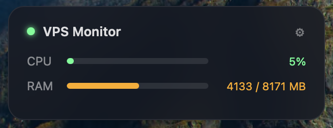

# VPS Monitor Widget for Übersicht

A draggable macOS desktop widget that shows real-time CPU and RAM usage of a Windows VPS via SSH.



## Requirements

- macOS with [Übersicht](https://tracesof.net/uebersicht/) installed
- `sshpass` installed: `brew install sshpass`
- Target server: **Windows** with PowerShell and SSH enabled

## Install

1. Copy `vps-monitor.jsx` and `vps-stats.sh` into your Übersicht widgets folder:
   ```
   ~/Library/Application Support/Übersicht/widgets/
   ```

2. Copy `vps-stats.sh` to `/tmp/`:
   ```bash
   cp vps-stats.sh /tmp/vps-stats.sh && chmod +x /tmp/vps-stats.sh
   ```

3. Upload `getstats.ps1` to your Windows server at `C:\Users\<username>\getstats.ps1`:
   ```powershell
   $os=Get-WmiObject Win32_OperatingSystem
   $cpu=(Get-WmiObject Win32_Processor).LoadPercentage
   $t=[math]::Round($os.TotalVisibleMemorySize/1024)
   $f=[math]::Round($os.FreePhysicalMemory/1024)
   $u=$t-$f
   $p=[math]::Round($u*100/$t)
   Write-Output "$cpu|$u|$t|$p"
   ```

4. Refresh Übersicht → click **⚙** on the widget → enter your server IP, username, and password → **Save & Connect**

## Features

- Real-time CPU & RAM with color-coded progress bars
- Draggable — position saves automatically
- Built-in settings panel (click ⚙)
- Shows offline status when server unreachable

## License

Tayakorn Wetchakun
